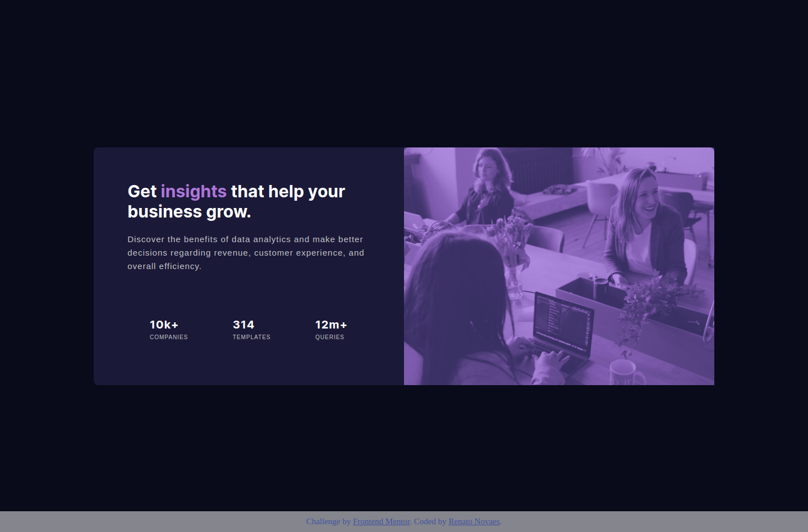
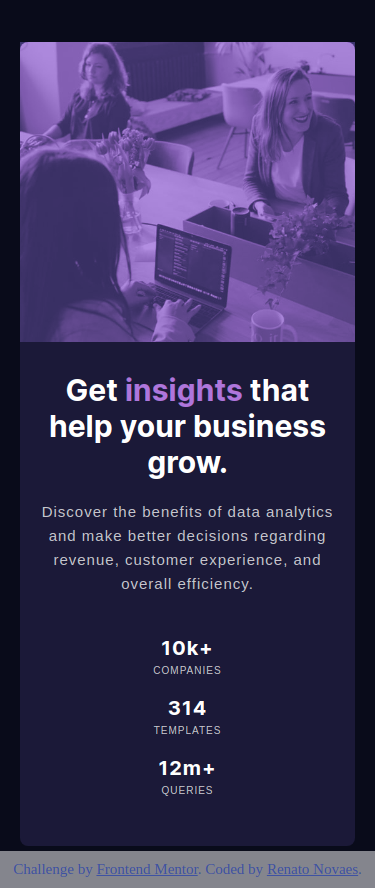

# Frontend Mentor - Stats preview card component solution

This is a solution to the [Stats preview card component challenge on Frontend Mentor](https://www.frontendmentor.io/challenges/stats-preview-card-component-8JqbgoU62). Frontend Mentor challenges help you improve your coding skills by building realistic projects. 

## Table of contents

- [Overview](#overview)
  - [The challenge](#the-challenge)
  - [Screenshot](#screenshot)
  - [Links](#links)
- [My process](#my-process)
  - [Built with](#built-with)
  - [What I learned](#what-i-learned)
  - [Continued development](#continued-development)
  - [Useful resources](#useful-resources)
- [Author](#author)

## Overview

### The challenge

Users should be able to:

- View the optimal layout depending on their device's screen size

### Screenshot

### Links

- Live Site URL: [Netlify](https://gifted-minsky-7a4248.netlify.app/)

## My process

### Built with

- Semantic HTML5 markup
- CSS custom properties
- Flexbox
- Mobile-first workflow

### What I learned

Positioning background images was something I struggled in the last challenge. For this one I think I made some progress. And it was really nice to learn how to put an overlay over the image.

### Continued development

Once again, I need to learn how to use SASS/SCSS apart from frameworks like VueJS.

### Useful resources

- [W3School - Background property](https://www.w3schools.com/cssref/css3_pr_background.asp) - This link comes with a list of the parameters you can use for background. There is a shortcut, but for achieve the mastery maybe it's better use each property separately.

## Author

- Website - [Renato Novaes](https://renatonovaes.dev)
- Instagram - [@novaes_r](https://www.instagram.com/novaes_r)
